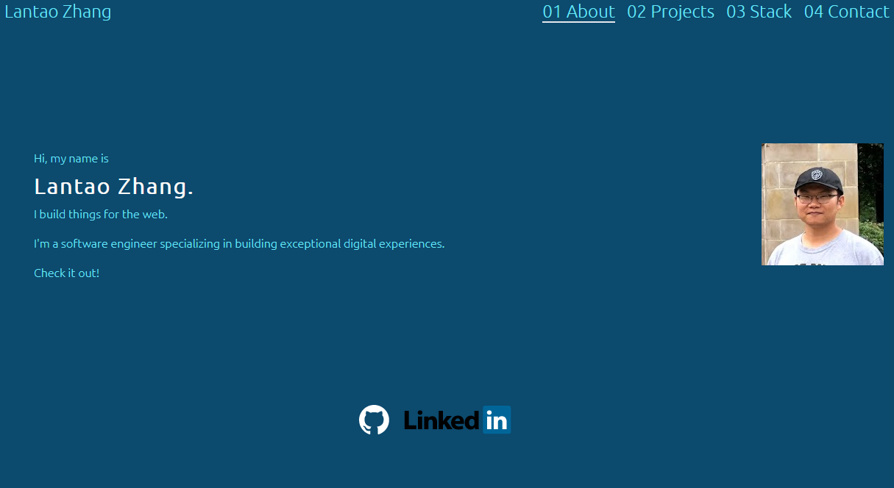

# portfolio-summary

<!-- PROJECT LOGO -->
 

  <h3 align="center">Portfolio Summary</h3>
 
  

    Challenge 20 on Portfolio Summary.

  

## Demo
 

  
Demo picture. (click to view)

(<a href="#readme-top">back to top</a>)

<!-- ABOUT THE PROJECT -->
## About The Project

### portfolio summary:
<li>Used React.js to create a SPA(single page app)
<li>Used Tailwind to add CSS
<li>Used useState, useEffect, prop

(<a href="#readme-top">back to top</a>)

<!-- LICENSE -->
## License

Distributed under the MIT License. See `LICENSE.txt` for more information.

(<a href="#readme-top">back to top</a>)

<!-- CONTACT -->
## Contact

Lantao Zhang - lantaook@gmail.com

Github Pages Link: [https://pppzlt.github.io/bc-react-portfolio/](https://pppzlt.github.io/bc-react-portfolio/)

(<a href="#readme-top">back to top</a>)

